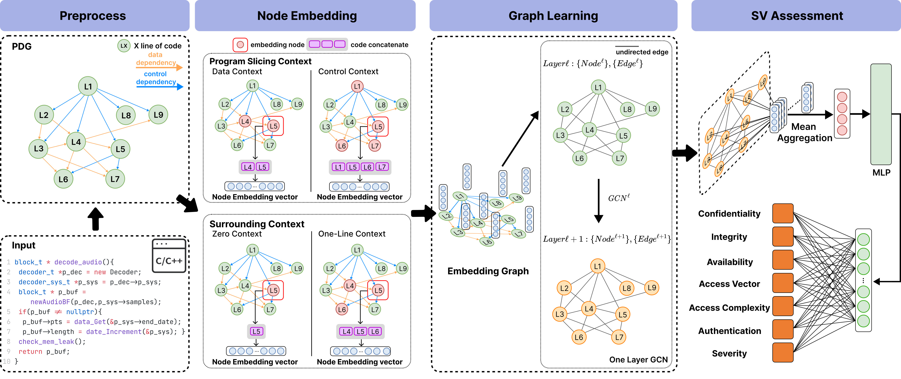

# FVA

<p align="center"> FVA: Assessing Function-Level Vulnerability by Integrating Flow-Sensitive Structure and Code Statement Semantic </p> 

## Quick Start

### Dataset preparation

You can download the preprocessed dataset from [HERE](https://drive.google.com/file/d/1Z4po8rktps_lpE5VOl3hIpEwV9kLFyjJ/view?usp=share_link) and unzip it.

The folder structure should be organized as follows.

```text
FVA_data.zip
├── metric.csv
├── mydata_split.csv
├── blaming_result.csv
```

The project will read the `mydata_split.csv` file, which contains the information about the division of the dataset. Each row corresponds to a function where the fields starting with `cvss2_` store the Vulnerability Metrics.
`func_after` represents the function with the vulnerability, `func_before` represents the function after the vulnerability is fixed.
`pre_context` and `cur_context` record the context information of the vulnerable statements.

We also provide dataset processing scripts, please refer to `Data_processing/readme.md` and `Data_processing/blaming/data/readme.md` 
### Requirements
- Linux
- Python 3.7+ (Tested on 3.7)
- PyTorch 1.8 or higher (Tested on 1.8.0)
- CUDA 11.1 or higher (Tested on 11.1)
- dgl 0.8.2+ (Tested on 0.8.2)

### Installation
conda environment and dataset installation
```shell
# clone this project  
git cloen https://xxxx/FVA.git
cd FVA

# create conda environment FVA 
conda env create -f environment.yml

# move FVA_v1_data.zip uncompressed files to FVA/Data
mv FVA_v1_data/* ./data
```

Joern installation
```shell
cd script
# we use the following joern version, please make sure the versions are the same
wget https://github.com/joernio/joern/releases/download/v1.1.260/joern-cli.zip
unzip joern-cli.zip
# if you have any questions about installing joern, please refer to the official documentation 
# https://docs.joern.io/installation/
# we use script/joern.py to call joern
```

### Result
We compared the performance with the other four baselines, average performance is reported in the following table.

**_average performance_**

| Model                 | Accuracy  | Precision |  Recall   | F1-score  |    MCC    |
|-----------------------|:---------:|:---------:|:---------:|:---------:|:---------:|
| DeepCVA               |   0.855   |   0.759   |   0.708   |   0.725   |   0.604   |
| CodeBERT              |   0.845   |   0.738   |   0.692   |   0.705   |   0.637   |
| Func<sub>_LGBM_</sub> |   0.850   | **0.858** |   0.719   |   0.754   |   0.673   |
| Func<sub>_RF_</sub>   |   0.820   |   0.828   |   0.667   |   0.699   |   0.632   |
| FVA                   | **0.869** |   0.789   | **0.813** | **0.795** | **0.727** |


We also provide the training and testing time of models as a reference.

**_computation cost(s)_**

|       | DeepCVA | CodeBERT | Func<sub>_LGBM_</sub> | Func<sub>_RF_</sub> | **FVA**  |
|:------|:-------:|:--------:|:---------------------:|:-------------------:|:--------:|
| Train | 4066.00 | 2821.00  |        394.71         |        6.66         | 18846.00 |
| Test  |  11.30  |   2.70   |         0.07          |        0.77         |  30.30   |


### Reproducing Results

FVA support different node embeddings, context selections and graph models.

Our node embedding supports four options
- codebert
- unixcoder
- textcnn
- lstm

Context selection supports four options(Parentheses describe the abbreviations used in our paper).
- nature(one-line context)
- data_flow(data dependency context)
- control_flow(control dependency context)
- sentence(zero context)

We use [dgl](https://www.dgl.ai/) library to support different graph models.
- gat 
- gatv2 
- gcn
- SAGEConv

You can switch the configuration of the FVA in the `gcn/multi_task/main.py:36` file at any time.
```python
context_type = 'sentence'
token_type = 'codebert'
gnn_type = "gcn"
```

#### RQ1
In RQ1 , we compared to baseline models for function-level SV assessment.

We set up the FVA with the following configuration (one-line context, CodeBERT for
node embedding, and GCN for graph model).
```python
# gcn/multi_task/main.py
context_type = 'nature'
token_type = 'codebert'
gnn_type = "gcn"
```

To train and test the FVA model , using the following commands. The result logging will be saved in the `result` directory.
```shell
conda activate fva
cd gcb/multi_task
CUDA_VISIBLE_DEVICES=0 python ./main.py
```

The other four baseline models are in the following directories.
```text
gcn
├── Deepcva             # DeepCVA model
├── multi_codebert      # Vanilla CodeBERT
├── function_level_Le   # LGBM and Random Forest
```
To train and test `DeepCVA` model , using the following commands.
```shell
cd gcn/Deepcva
python extract_features.py # run this file to get feature
python model.py # train and test DeepCVA
```
To train and test `Vanilla CodeBERT` , using the following commands.
```shell
cd gcn/multi_codebert
python extract_tokens.py # run this file to get cache tokens
python main.py # train and test CodeBERT
```
To train and test `LGBM` and `Random Forest` , using the following commands.
```shell
cd gcn/function_level_Le
python extract_feature_codebert.py # get codebert feature
sh evaluate.sh # evaluate model
python get_best_result.py # get best result
```

#### RQ2
In RQ2,we study the effect of different vulnerable statement contexts on FVA performance.

We used the following four configurations to train the FVA.
```python
# gcn/multi_task/main.py
context_type = 'nature'
token_type = 'codebert'
gnn_type = "gcn"

context_type = 'data_flow'
token_type = 'codebert'
gnn_type = "gcn"

context_type = 'control_flow'
token_type = 'codebert'
gnn_type = "gcn"

context_type = 'sentence'
token_type = 'codebert'
gnn_type = "gcn"
```

#### RQ3
In RQ3,we study the effect of different node embeddings on FVA performance.

We used the following three configurations to train the FVA.
```python
# gcn/multi_task/main.py
# CodeBERT node embedding
context_type = 'nature'
token_type = 'codebert'
gnn_type = "gcn"

# UniXcoder node embedding
context_type = 'nature'
token_type = 'unixcoder'
gnn_type = "gcn"

# LSTM node embedding
context_type = 'nature'
token_type = 'lstm'
gnn_type = "gcn"
```

`FastText` node embedding is stored in a separate folder `fasttext_embedding_graph_model`,because we need preprocess to get *n-gram* tokens.Using following commands to train and test `FastText` node embedding FVA models.
```shell
cd gcn/fasttext_embedding_graph_model
python main.py
```

#### RQ4
In RQ4,we study using different graph embedding models to assess SVs.
```python
# gcn/multi_task/main.py
# GCN Graph Embedding
context_type = 'nature'
token_type = 'codebert'
gnn_type = "gcn"

# GAT Graph Embedding
context_type = 'nature'
token_type = 'codebert'
gnn_type = "gat"

# GAT-V2 Graph Embedding
context_type = 'nature'
token_type = 'codebert'
gnn_type = "gatv2"

# GraphSAGE Graph Embedding
context_type = 'nature'
token_type = 'codebert'
gnn_type = "SAGEConv"
```


### Citation